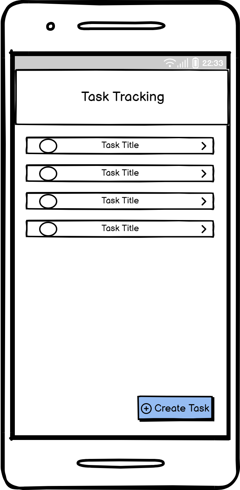
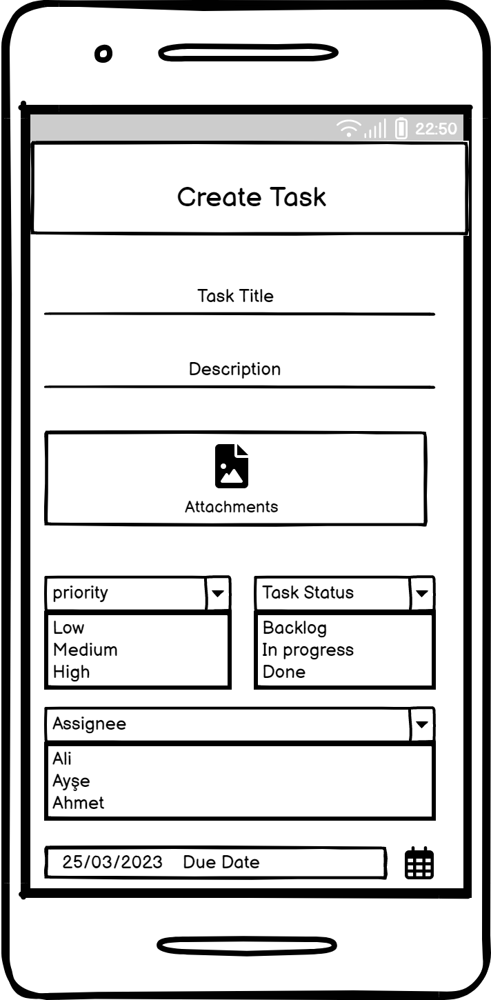
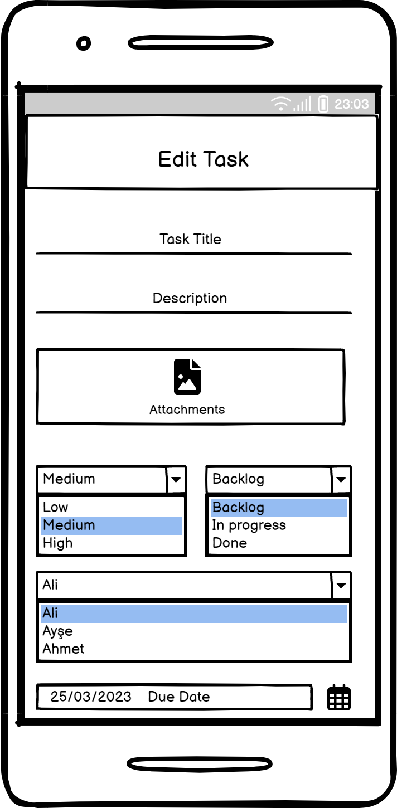
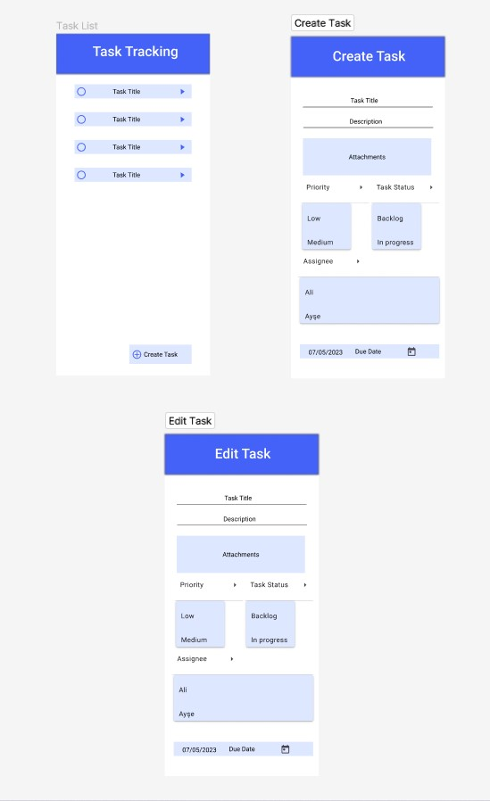

# PROJECT MANAGEMENT TOOL

https://github.com/dogukanyilmaz/project-management-tool/assets/67391004/7db263b3-9de3-4aa2-bd76-f4f0d3f3b4a6

## Application Screens

## Mock-Up

## Figma Design

[Figma Linki için tıklayınız.](https://www.figma.com/file/iWUcAF3klYVlMv8xCFp1Wt/Untitled?type=design&node-id=0%3A1&t=QAT9BFL1gsxdtB7j-1)

